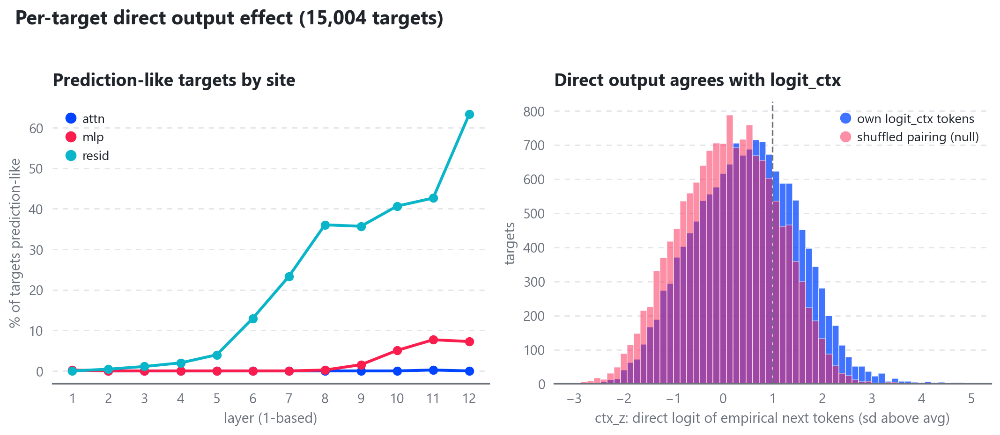
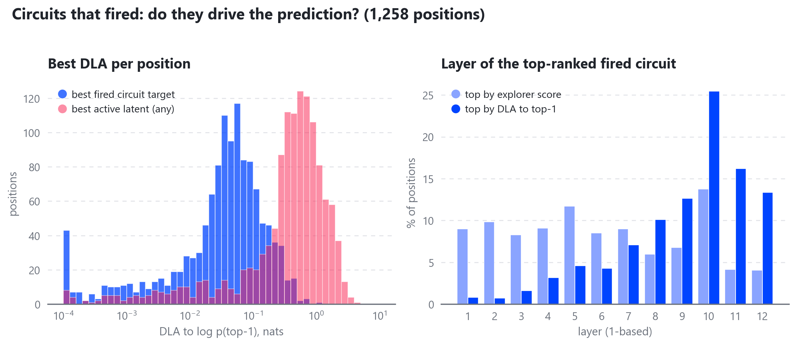
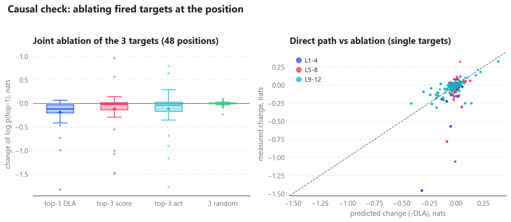
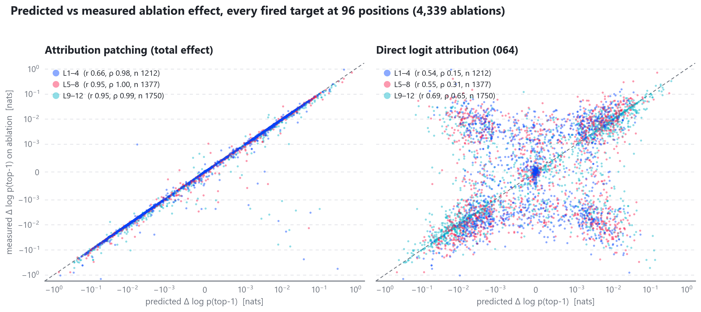

# 064 — Prediction circuits (Linear DAN-134)

**Question (Daniel).** When you click a token on the Turing Explorer v2 inference page, "Circuits That Fired" shows mostly circuits that *describe* that token and nothing about what comes *next*. Do any of the 15,004 protocol-v1 (062) circuits relate to the next token or the logit distribution? And how can we look for them? (A CLI is included below.)

**Short answer.**
- **Prediction-like targets exist, but only in the deep residual stream.** 1,293 targets (8.6%) are prediction-like: 1,192 resid, 100 mlp, 1 attn. That is 22% of resid targets overall and 63% of the L12 resid targets. 675 of them pass the adopted rule.
- **Targets are no more output-like than random latents at the same site.** Circuit targets are chosen as circuit targets, not because they predict.
- **At inference, fired circuits contribute very little to the prediction.**
  - The best fired circuit per position moves log p(top-1) by a median of **0.04 nats**, directly. It reaches 0.25 nats at only 5.6% of positions.
  - The best active latent of *any* kind (circuit or not) has a median of **0.48 nats**. It is a circuit target only **0.7%** of the time, which is the base rate: about 1% of active latents are targets.
- **The explorer's score ordering is unrelated to prediction.** The circuit the score ranks first has a median DLA of 1e-5 nats, and the Spearman correlation between score and DLA is 0.01.
- **Ranking by DLA works causally, but the effects are small.**
  - Ablating the top-3 targets by DLA lowers log p(top-1) about 5× more than the top-3 by score, and about 4× more than the top-3 by activation.
  - All three paired comparisons (against score, activation and random) have p ≤ 0.002.
  - The absolute size is small: a median of −0.019 nats per target, or −0.12 nats for the three together.

## Method

**Tools.** Everything ran on CPU with the research `src/` stack: `Inference`, `SAEBank`, `model/hooks.py` `multi_patch`, and `sae/dense.py`. The 062 explorer bundle was opened read-only.

### Final norm
- Only the final RMSNorm (`norm_f`) lies between a site and the logits on the direct path.
- **Static per-target effects** linearise it at a typical scale: `rms_typ` = 4.53. This is the median final-residual rms over 64 random corpus sequences at positions ≥ 1; the 10th–90th percentile range is 3.9–5.6.
- **At inference** it uses the exact Jacobian at each position: `J d = g ⊙ (d − x (x·d)/(n·rms²)) / rms`.

### 1. Per-target direct effect (`target_effects.py`)
- The logit vector is `ℓ = W_U (g ⊙ d) / rms_typ`, where d is the unit decoder column. It is taken over the real vocabulary (ids < 32,064) and centred.
- **Recorded per target:**
  - the top-20 promoted and top-20 suppressed tokens
  - the top-1 z-score, `z1 = ℓ_max/sd`
  - the excess kurtosis
  - the unembedding gain: `sd(ℓ)` relative to random unit directions
  - `boost@peak`: `ℓ_max` × the target's peak activation (the explorer's target peak). This is how many nats the top token gains over the average token at peak.
  - `ctx_z`: the mean z-score of `ℓ` over the latent's top-10 distinct `logit_ctx` next tokens
  - `ctx_z_shuf`: the same, with each latent paired with a random latent at the same site (null)
- **This is the direct path only.** attn and mlp directions add into the residual at their layer, and a resid direction is the residual itself; every later block can transform either.
- **Null.** The same metrics for 1,024 random live non-target latents per site (36,864 in total).

**Tiers.** These were fixed before the inference results were seen, and are computed in `summarise.py`.

| tier | rule | count | passing |
|---|---|---|---|
| writer | boost@peak ≥ 1 nat | 2,390 (15.9%) | 1,246 |
| **prediction-like** | writer AND ctx_z ≥ 1 | **1,293 (8.6%)** | **675** |
| focused | prediction-like AND z1 ≥ the site null's 95th percentile | 140 (0.9%) | 74 |

Pass rates: prediction-like 52%, all targets 46%.

### 2. Inference (`inference_dla.py`)
- **Inputs.** 18 hand-written prompts (BOS + prompt) and 16 random 64-token corpus sequences: 1,258 non-BOS positions (245 from prompts, 1,013 from the corpus).
- **At every position**, for every fired circuit (the target's post-TopK activation > 0, as in the explorer):
  - the explorer score, replicated from `circuit_index.py`
  - **DLA to log p(top-1)** and to log p(true next): `a · (u_tok − Σ_j p_j u_j) · J d`
- DLA is taken to the log-prob rather than to the raw logit, so a direction that lifts every logit equally gets zero.
- The same DLA is computed for all 4,608 active latents, to ask whether the latents that drive the prediction are circuit targets at all.

### 3. Causal check (same script)
- **Sample:** 48 positions (24 prompt, 24 corpus), each with ≥ 12 fired circuits.
- **Single-target ablations,** four sets of three at each position:
  - top-3 by DLA
  - top-3 by explorer score
  - top-3 by activation (the largest write, since ‖d‖ = 1)
  - 3 random fired circuits, excluding the DLA and score top-3
- Each set is also ablated jointly.
- **Ablation.** The latent is zeroed in its SAE reconstruction at that position only and spliced back with the error term kept, which equals `x − a·d`. This matched the explicit encode → zero → decode + error path to 5e-6 in the logits.
- **Measured:** the change in the top-1 logit and log-prob, and KL(base ‖ ablated).

## Results

Full tables are in `results/tables.md`; the numbers are in `results/summary.json`.

### Where the prediction-like targets are (fig 1)



| layer (1-based) | attn | mlp | resid | prediction-like and passing |
|---|---|---|---|---|
| 1–5 | 0 | 1 | 34 | 30 |
| 6 | 0/355 | 0/454 | 59/455 (13%) | 50 |
| 7 | 0/424 | 0/455 | 106/455 (23%) | 82 |
| 8 | 0/379 | 1/454 | 164/455 (36%) | 105 |
| 9 | 0/338 | 7/455 (2%) | 162/454 (36%) | 94 |
| 10 | 0/447 | 23/455 (5%) | 185/455 (41%) | 117 |
| 11 | 1/434 | 35/455 (8%) | 194/455 (43%) | 95 |
| 12 | 0/438 | 33/455 (7%) | 288/455 (63%) | 102 |

- **Targets vs null.** Target medians match the same-site null on every metric: z1 5.22 vs 5.23 (resid), gain 1.05 vs 1.05, ctx_z 0.89 vs 0.93. Circuit targets are **not enriched** for output directions. The deep-resid pattern is a property of the site, not of the circuits.
- **Agreement with logit_ctx is real but modest.** 31% of targets have ctx_z ≥ 1, against 19% under the shuffled pairing.
- **Examples.**
  - The strongest writers are late resid latents that complete words: 11.resid.10792 promotes `ough ots um arts anks`, and 9.resid.5371 promotes `unci ounced oun ounce`.
  - A few are semantic: 10.resid.32101 promotes ` ph sounds pron sound vocal`, and it fires on phonetics text.

### Do they fire and drive predictions? (fig 2)



| ranking of fired circuits | mean layer (0-based) | resid/mlp/attn % | median DLA to top-1 | pass % |
|---|---|---|---|---|
| explorer score, #1 | 5.0 | 56/30/13 | **0.00001** nats | 52 |
| DLA to top-1, #1 | 8.1 | 80/16/4 | **0.041** nats | 38 |

- **Fired circuits per position:** a median of 45.
  - 6.3% of fired instances are prediction-like targets.
  - Prediction-like targets are 29% of the per-position DLA winners.
- **Size of the best fired circuit's DLA:** ≥ 0.1 nats at 21% of positions, ≥ 0.25 at 5.6%, ≥ 0.5 at 0.5%, ≥ 1 at 0.1%.
- **The best active latent of any kind:** ≥ 0.5 nats at 48% of positions. These are late resid latents (97% resid, 95% in L9–12), and 99.3% of them have **no circuit**.
  - The best circuit target is ranked 66th among all active latents (median).
  - Targets carry 0.85% of the positive DLA.
- **Score vs DLA.**
  - The Spearman correlation between score and DLA is 0.01.
  - The top-DLA circuit sits at a median rank of 9 in the explorer's score order.
  - The top-5 lists by score and by DLA share 1.1 circuits on average.
- **The single largest fired-circuit DLA** in all 1,258 positions is 1.0 nat. It is at `…complexity of spoken word.<s> Through the study [[ of]]` → ` ph` (p 0.29; the actual next token is ` articulatory`), from 10.resid.32101 (corpus seq 3509407, position 20).

### Causal check (fig 3)



Medians over 144 single ablations per set (48 positions × 3):

| set | predicted DLA | Δ log p(top-1) [95% CI] | KL | top-1 flips | joint Δ log p | joint flips |
|---|---|---|---|---|---|---|
| **top-3 DLA** | 0.033 | **−0.0194** [−0.030, −0.014] | 0.0010 | 8.3% | **−0.117** | 23% |
| top-3 score | 0.0004 | −0.0031 [−0.005, −0.001] | 0.0016 | 4.9% | −0.021 | 13% |
| top-3 activation | 0.0034 | −0.0047 [−0.018, −0.000] | 0.0041 | 9.7% | −0.036 | 13% |
| 3 random | 0.0002 | −0.0006 [−0.002, 0.000] | 0.0001 | 2.1% | −0.0003 | 6% |

- **Paired per position** (mean of the 3 singles), the DLA set lowers log p(top-1) more:
  - than the score set at 73% of positions (Wilcoxon p = 0.002)
  - than the activation set at 75% (p = 0.0004)
  - than the random set at 90% (p = 4e-10)
- **KL tells a different story.** The DLA targets move the *whole* distribution *less* than the score or activation sets: KL is lower at 56% of positions against score (p = 0.03) and 79% against activation (p = 2e-6). DLA picks writes aimed at the top-1 token, while the large-activation targets reshape the distribution broadly.
- **Overlap.** 33 of the 144 DLA picks were also score picks.
- **How well the direct path predicts ablation.** Predicted (−DLA) vs measured Δ log p(top-1), over all 576 single ablations:

| layers | Pearson | Spearman | slope measured/predicted |
|---|---|---|---|
| L1–4 | 0.74 | 0.35 | 3.8 |
| L5–8 | 0.57 | 0.47 | 2.2 |
| L9–12 | 0.72 | 0.71 | 0.61 |
| all | 0.50 | 0.60 | 1.1 |

The direct path is a fair guide in the last four layers, where it slightly over-predicts. In early layers the real effect is mostly indirect: it is about 2–4× larger and ranks poorly. Treat DLA for L1–8 targets as a lower bound on their influence.

## The CLI

`circuits_cli.py`, run from the repo root with `PYTHONPATH=src`.

- **Loading.** It loads lazily: `target` and `top-predictors` need only the bundle (about 5 s). The first `run` loads the model, the 36 SAEs and the 7.5M member rows (about 50 s on CPU). After that a 64-token run takes about 3 s.
- **Starting it.** With no arguments it starts a REPL that keeps everything loaded. With arguments it runs one command.
- **Labels** are 1-based (`L11 · RESID · 32102`), with the 0-based research key alongside (`10.resid.32101`).

```
python experiments/064-prediction-circuits/circuits_cli.py
circuits> run "The Eiffel Tower is located in the city of" --gen 3        # per position: token, top-5 next, fired circuits by DLA
circuits> run "The Eiffel Tower is located in the city of" --sort score   # the explorer's order, for comparison
circuits> pos 11                     # one position: circuits by DLA (top-1 and actual next) and by score, + top latents of ANY kind
circuits> target 10.resid.32101      # or L11.resid.32102 / "L11 · RESID · 32102"
circuits> top-predictors --layer 12 --kind resid --pass-only --tier focused -n 20
```

**Columns of `run`:** DLA to top-1 (nats), target activation, explorer score, pass, target label, and the target's top promoted tokens.

**`target`** shows:
- the top promoted and suppressed tokens with their values
- the output-ness metrics and tiers
- the `logit_ctx` next tokens
- the circuit's pass status and metrics (Z / A / C, phi_sup, near-threshold, amplifier)
- snippets of the strong-pool top contexts (from `tokens.npy`)

A latent that isn't a circuit target has its direct effect computed live.

**Reproduce:**
```
PYTHONPATH=src python experiments/064-prediction-circuits/target_effects.py   # ~8 min CPU
PYTHONPATH=src python experiments/064-prediction-circuits/inference_dla.py    # ~4 min CPU
PYTHONPATH=src python experiments/064-prediction-circuits/summarise.py        # tables + figures
```

## Recommendation for the explorer

1. **Add a "Prediction" sort and column to Circuits That Fired.**
   - It is DLA to the model's top-1 (and, for a clicked continuation, to the actual next token). It is cheap at inference:
     - The server already has the final residual (`capture` returns the block-11 resid) and the logits.
     - Per position, add one d-vector `v = g ⊙ (u_top1 − Σ p_j u_j)/rms`. With `n` = the residual width (1,024), each fired circuit then costs `a·(d·v − (v·x)(x·d)/(n·rms²))`.
     - That needs the fired targets' decoder columns: 15,004 × 1,024 f32 = 61 MB, loaded once. Everything else is a dot product per fired circuit, well under 1 ms per token.
   - Show the model's top-5 next tokens in the token panel so the column has a referent.
   - This is the change that directly answers "nothing to do with prediction". It surfaces a different, deeper set (mean layer 8 vs 5), and the causal check shows the ordering means something.
   - Label it honestly: "direct effect; early-layer circuits act mostly indirectly".
2. **Precompute each target's top promoted and suppressed tokens into the bundle** as a new converter stage (for example stage 8, `target_logits`).
   - Store: 20 + 20 token ids and values per target, the tier flags, boost@peak, z1 and ctx_z. That is about 2 MB. `target_effects.py` already computes all of it, so the stage can call the same code.
   - Show it on the **latent and circuit pages** ("writes: ` ph`, ` sounds`, ` pron`…") and as a chip in Circuits That Fired.
   - To cover every latent, not only targets, the same pass over 1.47M latents is roughly tens of minutes on CPU, or minutes on a GPU. At 20 + 20 ids with f16 values, that is about 350 MB.
3. **Filter "prediction-like" on the Circuits page** (the tier flags) so deep resid writers can be browsed. There are 675 passing.
4. **Be clear about what users will find.**
   - The explorer's circuits are overwhelmingly *not* where the prediction is made: 99% of the strongest direct predictors at a position have no circuit.
   - Seeing prediction circuits properly would need circuits *seeded on output-relevant latents*, i.e. a discovery run whose targets are chosen by DLA/boost. The deep-resid writers above are the obvious seed list: 2,390 writers, most of them not yet targets.
   - The explorer can also show the "top active latents by DLA" list, as `pos` does, even when they have no circuit.
5. **Optional: fix `logit_ctx`** before relying on it in the UI (see Caveats). Store count-weighted mean probabilities with de-duplication instead of a max-prob top-32.

## Caveats

- **The direct path only.** DLA ignores what later layers do with a write (see the fidelity table: fine for L9–12, a 2–4× underestimate for early layers).
- **The norm Jacobian is exact, but first order.** Ablation effects are exact, not linearised.
- **resid latents reconstruct the whole stream** at their layer, so their "writes" overlap with the attn/mlp contributions below them. Summing DLA across sites double counts; I only rank, and never sum across sites.
- **The "writer" tier uses the target's peak activation,** which is its strongest context and not a typical one. At mean activation, boosts are about 5× smaller (median 0.06 nats).
- **`logit_ctx` is a weak, saturated reference.**
  - It records only the last position of each 64-token corpus sequence, and its merge keeps the *max* probability with duplicate entries.
  - A median of 11 of the 32 slots are distinct tokens.
  - For 56% of targets, all top-10 distinct tokens sit at p ≥ 0.99, so the lists are dominated by generic near-certain completions (`es ed ing on`).
  - ctx_z beats the shuffled null in both the saturated and unsaturated groups (0.40 vs 0.10, and 0.62 vs 0.18), so it carries signal, but it is a crude confirmation.
- **Some top-DLA latents are generic.** One example is 9.resid.7549 (promotes `usk amid dawn <s>`), which tops DLA at many positions with modest values. DLA rewards any write aligned with `u_top1 − E_p[u]`; it does not by itself mean the latent is specific to that token.
- **Small sample.** There are 48 causal positions and 34 sequences, and the prompts are short. Effect sizes are small in absolute terms, even for the best circuits.
- **CPU fp32 forward.** The explorer runs the same maths; the capture is verified identical upstream.

## Attribution patching vs ablation (DAN-135)

**Question.** Can a gradient-based total effect replace DLA in the explorer's "Prediction" sort? The estimate is `est_i = −a_i · (d_i · ∂ log p(top-1)/∂x_site)`, the first-order estimate of the ablation above. Here x_site is the SAE input as captured (attn out, mlp out, or post-block resid). One backward pass per position gives the gradient for all 36 sites. The same estimate is also computed with the top-1 logit in place of log p.

**Script.** `attribution_check.py` (CPU, about 2 min end to end).
- Fired lists, activations, score and `dla_top1` come from `dla_fired.parquet`. Positions and top-1 tokens come from `dla_positions.parquet`. Sequences come from `inference_dla.sequences`.
- Ablations use 064's definition (`x − a·d` at the position, SAE error kept). They run batched on the input truncated to `ids[:t+1]`.

**Sanity check.**
- 20 random `causal.parquet` rows were re-ablated. 064's own `ablate_logits` reproduces `d_logp_top1` to exactly 0. The batched, truncated version reproduces it to ≤ 1e-5.
- All 576 single rows were re-measured in the exhaustive pass, with a maximum difference of 8e-6.

**Sample (extended).** Every fired target was ablated at 96 positions: the 48 positions from 064 plus 48 fresh ones under the same rule (n_fired ≥ 12, half prompt and half corpus). That gives 4,339 single ablations: 1,212 in L1–4, 1,377 in L5–8 and 1,750 in L9–12. Each ablation is a full forward pass, so these are exact ablations, not estimates. Results are in `results/attribution_check.parquet` and `results/attribution_check_summary.json`.



**Fidelity** (exhaustive sample). Predicted vs measured Δ log p(top-1). For DLA the prediction is `−dla_top1`. "slope" is the OLS slope of measured on predicted. "sign" is the sign agreement on rows with |Δ| ≥ 0.01 nats. The score column is Spearman(score, −Δ).

| layers | n | est r / ρ | est slope | est sign | DLA r / ρ | DLA slope | DLA sign | score ρ | est(logit) r / ρ vs Δ logit |
|---|---|---|---|---|---|---|---|---|---|
| L1–4 | 1,212 | 0.66 / **0.98** | 1.30 | 99.0% | 0.54 / 0.15 | 3.1 | 58% | 0.03 | 0.79 / 1.00 |
| L5–8 | 1,377 | **0.95 / 1.00** | 1.02 | 99.8% | 0.55 / 0.31 | 1.25 | 67% | −0.01 | 0.98 / 0.99 |
| L9–12 | 1,750 | **0.95 / 0.99** | 1.05 | 99.5% | 0.69 / 0.65 | 0.71 | 85% | 0.06 | 0.91 / 0.97 |
| all | 4,339 | 0.80 / 0.99 | 1.10 | 99.5% | 0.49 / 0.43 | 0.96 | 73% | 0.03 | 0.86 / 0.99 |

The median absolute error is 1e-4 nats for est and 4e-3 nats for DLA. On 064's original 576-row sample, est gives r/ρ of 0.41/0.75 for L1–4, 0.98/0.99 for L5–8 and 0.94/0.96 for L9–12; DLA gives 0.74/0.35, 0.58/0.47 and 0.72/0.71.

**Where it fails.** The low L1–4 Pearson comes from a handful of large early-resid ablations, and the estimate is nonlinear there.
- By site in L1–4, Pearson is 0.998 for attn and 0.98 for mlp, but 0.55 for resid.
- The top 5 errors are 93% of the L1–4 squared error. Without them Pearson is 0.90.
- The worst case is a 4.resid target (1-based): est −0.05, measured −1.46, and the top-1 flips.
- On large effects (|Δ| ≥ 0.05 nats), the median relative error is 5–9% and the 90th percentile is 35–60%.
- Softmax saturation is not a problem here. Pearson is 0.80 at p(top-1) < 0.5 and 0.90 at p ≥ 0.9, with slopes of 1.0–1.1.

**Ranking** (product use: 96 positions with every fired target ablated). The truth is the target whose ablation lowers log p(top-1) most.

| ranker | top-1 hit | true best in top-3 | mean drop of top-3 picks (nats) | median per-position ρ | \|Δ\| top-1 hit |
|---|---|---|---|---|---|
| **est (attribution patching)** | **84%** | **93%** | **0.078** | **1.00** | **84%** |
| DLA | 48% | 64% | 0.055 | 0.44 | 44% |
| explorer score | 28% | 54% | 0.031 | 0.01 | 27% |
| activation | 35% | 70% | 0.033 | 0.08 | 44% |
| oracle | 100% | 100% | 0.086 | 1.00 | 100% |

The top-1 hit rate splits by the band of the true best target:

| band of the true best | positions | est | DLA |
|---|---|---|---|
| L1–4 | 20 | 75% | 30% |
| L5–8 | 31 | 87% | 35% |
| L9–12 | 45 | 87% | 64% |

**Joint ablations** (064's 192 sets of 3). The sum of the three ests vs the joint ablation gives r 0.60 / ρ 0.89 with slope 1.25. Summed DLA gives 0.38 / 0.57. For the random sets the fit is near-perfect (r 0.998). Sets that contain large-write targets interact, so their effects are not additive.

**Verdict.** Attribution patching is a good proxy for the single-target ablation and clearly better than DLA at every depth.
- **L5–12:** it is close to exact (r 0.95, ρ 0.99–1.00, slope ≈ 1).
- **L1–4:** it is still rank-faithful (ρ 0.98 vs DLA's 0.15; sign 99% vs 58%). It does miss the magnitude of a few large early-resid ablations, sometimes by 10×+.
- **Ranking:** it finds the most important fired target at 84% of positions, against 48% for DLA and 28% for the explorer score. Its top-3 picks recover 91% of the oracle's mean effect, against 64% for DLA.
- **Recommendation:** use est to log p(top-1) as the "Prediction" sort, and label it "first-order total effect".
- **Cost:** one extra backward pass per position. That is a backward pass per clicked token, and it does not need the 61 MB decoder matrix beyond what DLA already needs.

**Caveats.**
- It is first order, so treat large L1–4 resid values as indicative, not exact.
- Joint effects are not additive for large writes.
- The sample is 96 positions from 34 sequences, all with ≥ 12 fired targets.
- Effects are measured at the clicked position only, as in 064.
